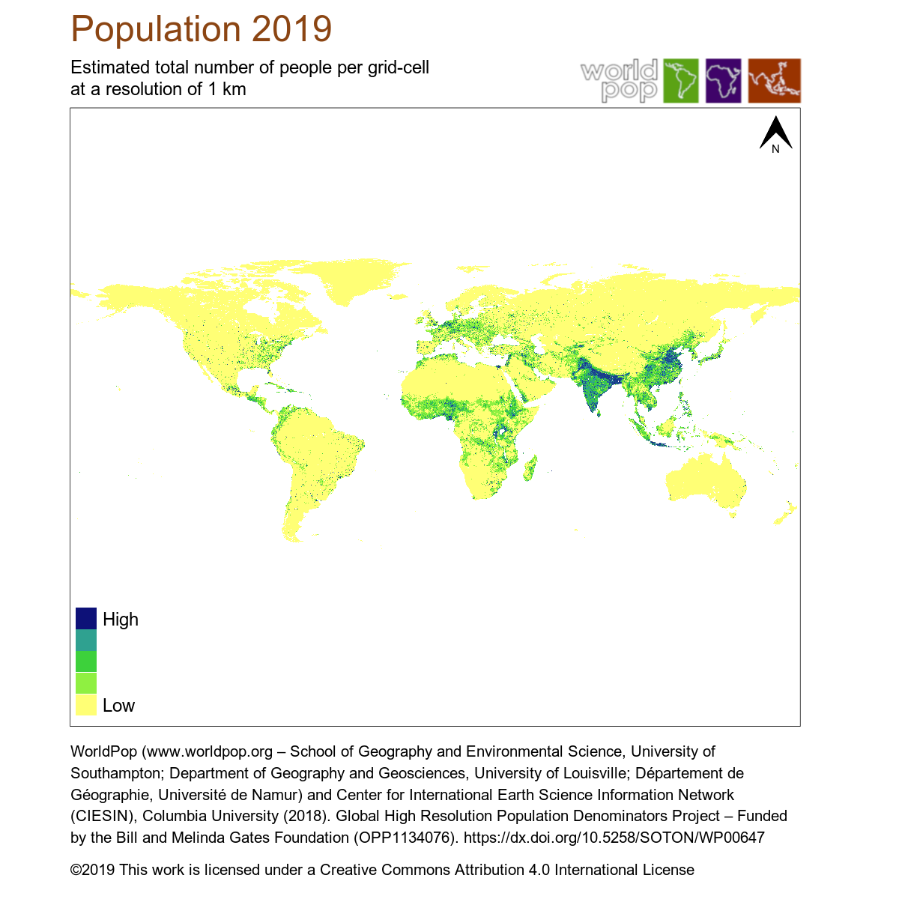

## When did 2020 start for most people?

Here's a fun little trivia question that a colleague recently asked. We know that the New Year starts at different UTC times for different places - we see the fireworks displays in Australia long before New York City, for example. But **by what time were most of the world's people in 2020?**

We could go by timezones and national population totals, but I think it would be fun to make an estimate using disaggregated population data from WorldPop (<http://www.worldpop.org>).

### Population Data

Start by downloading the gridded population data from the WorldPop website. We'll use the 1km spatial resolution global mosaic for the year 2019. Note this file is 1 Gb in size. All the data are free: <https://www.worldpop.org/geodata/summary?id=24776> and you can find more information on how the data are made at the website.

{width=500px}

#### Load the data


```r
library(raster) # used for reading/writing spatial gridded data

wp2019 <- raster("./dat/ppp_2019_1km_Aggregated.tif")
  print(proj4string(wp2019))
```

```
## [1] "+proj=longlat +datum=WGS84 +no_defs +ellps=WGS84 +towgs84=0,0,0"
```

```r
  print(dim(wp2019)) # dimensions
```

```
## [1] 18720 43200     1
```

### Calculation

When our initial question asks for *most* people, I'll interpret that as *at least* half. So the answer we're looking for can be the UTC time for midnight just after degree of longitude that divides the world's population in half. Or say that last part another way, the population-weighted median degree of longitude. Of course we're going to be somewhat limited by the resolution of our grid.

We'll start by getting the total population in each column of the WorldPop grid.

```r
popsums <- colSums(wp2019, na.rm=T)
  print(head(popsums))
```

```
## [1] 1568.8151 1667.7298 1439.9355 1368.0102  773.0466  586.8260
```
These will become our weights.

Next, get the degree of longitude for each column of the WorldPop grid.

```r
dd_lon <- xFromCol(wp2019)
  print(head(dd_lon))
```

```
## [1] -179.9971 -179.9887 -179.9804 -179.9721 -179.9637 -179.9554
```

To calculate the weighted median, we'll use another package.

```r
library(spatstat)

wgt_median_lon <- weighted.median(dd_lon, popsums, na.rm=T)
  print(wgt_median_lon)
```

```
## [1] 73.99474
```

It's about 4 minutes for each degree of longitude, converted to hours, and the median is positive so it's to the east and ahead of UTC time.

```r
hours_diff <- (wgt_median_lon * 4)/60
  print(hours_diff)
```

```
## [1] 4.932982
```

```r
utc_diff <- 24 - hours_diff # midnight - difference
  print(utc_diff) # UTC time when midnight passed the median meridian
```

```
## [1] 19.06702
```
And where is it??

<!-- -->

#### Happy (belated) new year to everyone!
So there you have it. Thanks for the good question, Randall. 


 


